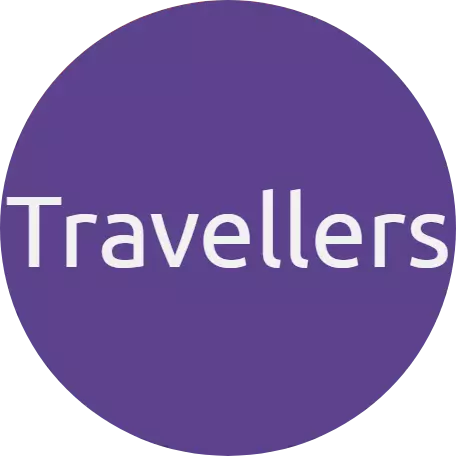
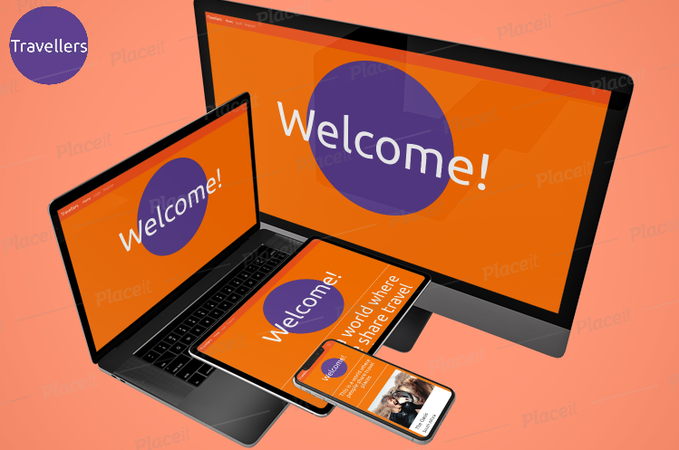
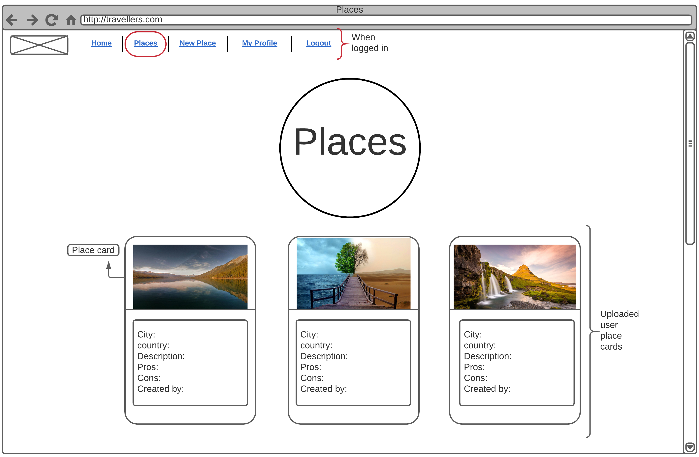
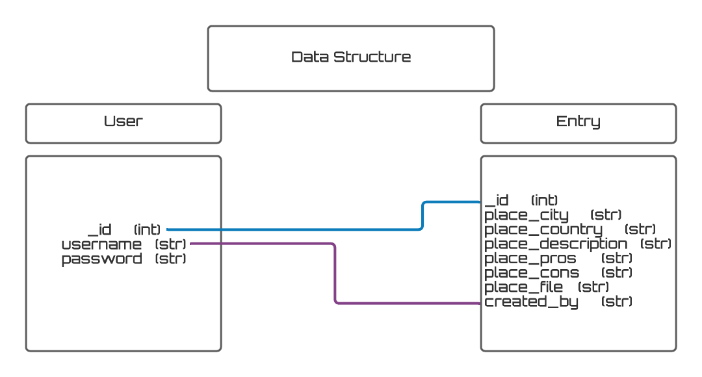
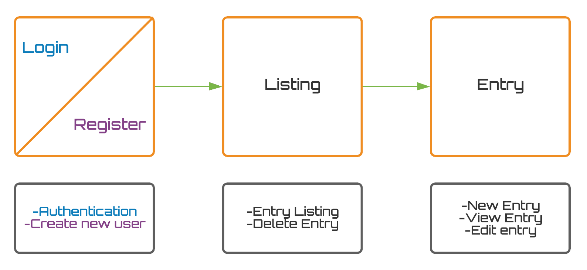
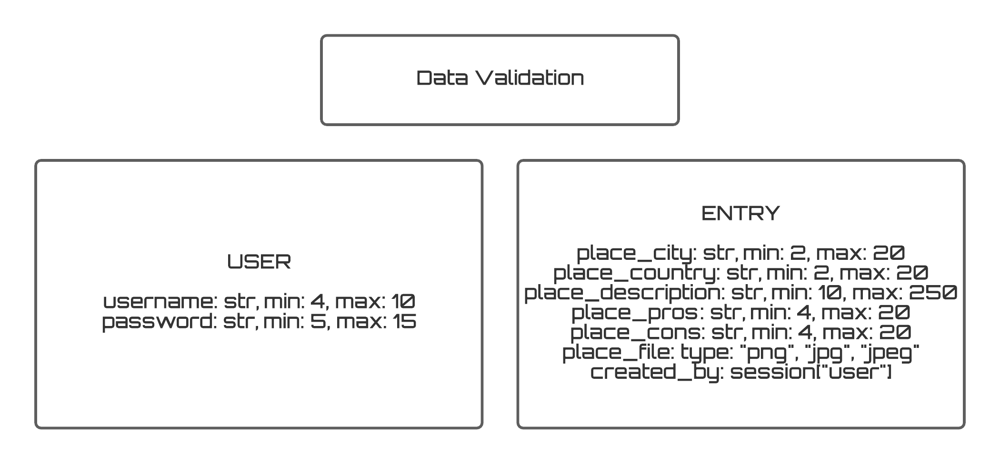

# Travellers

- [Travellers](#travellers)
  - [UX](#ux)
    - [Project Goal](#project-goal)
    - [User Stories](#user-stories)
    - [Wireframes](#wireframes)
    - [Views and Data Structure](#views-and-data-structure)
    - [Design](#design)
      - [Typography](#typography)
      - [Color Scheme](#color-scheme)
  - [Features](#features)
    - [Existing Features](#existing-features)
      - [Account Registration](#account-registration)
      - [User Session](#user-session)
      - [Create New Entries, Place cards](#create-new-entries-place-cards)
      - [Places page](#places-page)
      - [View, Edit, and Delete cards](#view-edit-and-delete-cards)
      - [Security](#security)
    - [Features Left to Implement](#features-left-to-implement)
  - [Technologies Used](#technologies-used)
  - [Tools Used](#tools-used)
  - [Testing](#testing)
  - [Deployment](#deployment)
    - [Local Deployment](#local-deployment)
    - [Deployment to Heroku](#deployment-to-heroku)
  - [Credits](#credits)
    - [Media](#media)
    - [Acknowledgements](#acknowledgements)

---

Travellers is an travel web application that offers users to create, edit, share and delete uploaded travel places. People travel and often forget what they did at a specific place, what they liked and disliked. This application allows users to upload travel places which will be public for other users. An easy to use application where people share travel destiantions with other people. 

It has been deployed to heroku and can be viewed from [here](https://travellers-ebuzer-yalcin.herokuapp.com/).

## UX

### Project Goal

Travellers is an application which can be used in different screen sizes. It is easy to use and understand. Navigation bar has only needed buttons and overall buttons is well thinked before implemented within the application. Whatever users do the application aims to give fast and intuitive experience. 

### User Stories

Users:
- As a user, I'd like to have a quick introduction about the page, why I should create an account. 
- As a user, I'd like the page to clearly show me where to register an account.
- As a user, I'd like the page to be smooth, easy to use.
- As a user, I'd like to interact and see other users uploaded travel cards.
- As a user, I'd like to share my own travel places by creating my own travel cards.
- As a user, I'd like to be able to upload image of a travel place. 
- As a user, I'd like to have intuitive buttons when I am logged in.
- As a user, I'd like to edit or delete my own travel cards.
- As a user, I'd like to get messages when I have added, edited or deleted a travel card. 

Content creator:
- As a content creator, I'd like to give an quick and understandable introduction of my page.
- As a content creator, I'd like to promote my page with nice looking travel cards on my Homepage. 
- As a content creator, I'd like to promote how to register.
- As a content creator, I'd like my page to be intuitive and informative for users.

### Wireframes

Based on user stories, wireframes were drawn. Full wireframes is found [here](static/images/readme/travellers-wireframe.png).

Final design looks quite similar to what was scetched at the beginning of this project. 

### Views and Data Structure

This is how the data structure look:

Views and actions:

Following image illustrates data validation the user can input:

These elements have been the same throughout the development stage.

### Design

This application have been built with bootstrap, such systems like grid and cards. The [Navbar theme](https://bootswatch.com/united/) and [Bootsrap cards](https://freefrontend.com/bootstrap-cards/) is some of the codes used in this project, while some styles were overwritten in [style.css](static/css/style.css) file.

Fonts and colors were choosen to create a clear look. I wanted an overall colorful and uplifting theme in this project. 

#### Typography

This font is used throughout the site:

1. **Ubuntu**: was used for the most as font in this project. This font was used for customized logo and for page texts. 

#### Color Scheme

I tried to use lots of colors which were matching, at she same time I wanted to use standard colors for buttons, delete button has a red colors which is characteristics of its name:

-   ) `rgb(241, 111, 4) - Dark, saturated orange`

This color was used throughout every page. Mainly because page content appeared nice with orange background and also because it blended in nive with the darker orange navigation bar.

-   ) `RGB(92, 66, 141) - Dark purple`

 Used in logo and circles with placeholder for what html page you are in. A color that pops out, simply an eyecatching color. Also used in forms.

-    `Hex(17A2B8) - Sweet blue`

This color is used as background color in footer section, blends overall in with orange. 

-    `#f1f1f1 - Super light grey`

Texts seemed to appear clearer with this color, suited well. 

-    `Hex(4CAF50) - Green`

This button color is used to submit register, login and submitting created travels cards. 

## Features

### Existing Features

#### Account Registration

-   People can register an account, choose a username and password:
    -   Username must be between 4 and 10 characters, pattern="^[a-zA-Z0-9]{4,10}$"
    -   Password must be between 5 and 15 characters, pattern="^[a-zA-Z0-9]{5,15}$"
    -   Requirement to fill the form to proceed registration

#### User Session

-   Existing users can log into their account using their chosen username and password
-   Same requirement to fill the form as the registration form, to login
-   Logout from account, closing session
-   Trying to accessing a page from the application while logged out, user will be redirected to login page

#### Create New Entries, Place cards

-   Users can create new entries, place cards, when logged in by clicking on New place button at the navbar
-   This is what the user needs to do to meet the requirements for validation:

    -   City name must be between 2 and 20 characters
    -   Country name must be between 2 and 20 characters
    -   The description must be between 10 and 250 caharters, a javascript function below the description input field is counting down the amount of charecters left
    -   Pros must be between 2 and 20 characters
    -   Cons must be between 2 and 20 characters
    -   A image url can be choosen, needs to be a url

All of these inputs are required.

#### Places page

-   The Places page is displaying all Place cards created by users chronologically, from most recently to oldest

#### View, edit, and delete cards

-   By clicking on My Profile, owner of the card can see all of its Place cards
-   Each Place card has two buttons, one to edit and one to delete the card
-   Place cards in this page is shown chronolically, from most recently to oldest
-   By clicking on edit user will be redirected to the edit place page
-   User can see all previous inputs and change inputs
-   If user don't want to change the card the editing can be cancelled by clicking on the cancel button, Place card will then remain the same

#### Security

Several steps were taken to ensure the security of the user's data.

-   The password users are using is secured with hashing method, a secret key which secures users password. It cannot be seen anywhere including the database.
-   For security reasons, if a user/person tries to access session features, application functionalitites which requires to be logged in, page will redirect to login page. This secority method keeps the application safe. 

### Features Left to Implement

-   Search for Places in place page.
-   Method to recover password, for this email information will also be needed.
-   Rate and/or mark Place cards as favourite.
-   Use an file api. When an image or gif is chosen, file is uploaded to a cloud so the app then can get the file via uploaded file url.
